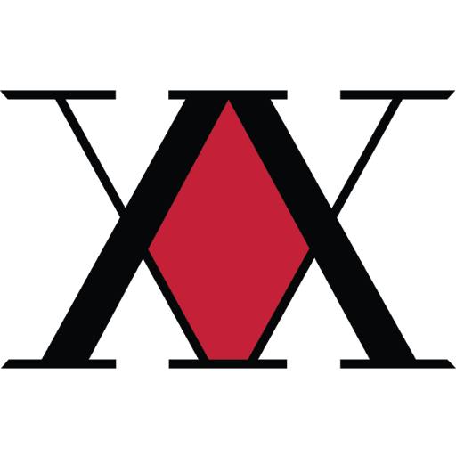

# 🏹 Hunter's Guild - Minecraft Server Platform

A powerful, automated, and easy-to-use Minecraft server management platform. Designed for hunters who want to host servers without the headache of manual configuration.



## ✨ Features
-   **🚀 One-Click Setup**: Everything runs in Docker. No need to install Java or databases manually.
-   **🎯 Dynamic Version Support**: Switch between **Vanilla** and **Forge** directly from the web dashboard.
-   **📦 Auto-Installer**: The server automatically downloads Mojang jars and installs Forge libraries for you.
-   **🛡️ IP Persistence (DuckDNS)**: Built-in container that automatically updates your DuckDNS IP every 15 minutes.
-   **💾 Automated Backups**: Integrated backup system to keep your worlds safe.
-   **💻 Web Control Panel**: Beautiful, modern dashboard to view logs, kick players, and manage files.
-   **☕ Java 21 Ready**: Optimized for Minecraft 1.21+ while remaining backward compatible.

---

## 🚀 Quick Start (Host on any machine)

### 1. Prerequisites
-   Install [Docker Desktop](https://www.docker.com/products/docker-desktop/) (Windows/Mac/Linux).

### 2. Setup
Clone this repository and create your configuration file:
```bash
# Copy the environment template
cp .env.example .env
```

### 3. Configure
Open `.env` and fill in these key settings:
-   `MC_MEMORY`: How much RAM (e.g., `4G`, `8G`).
-   `ADMIN_PASS`: Your password for the web dashboard.
-   `DUCKDNS_DOMAIN`: Your DuckDNS sub-domain (e.g., `my-cool-server`).
-   `DUCKDNS_TOKEN`: Your DuckDNS token.

### 4. Deploy
Run the entire platform with one command:
```bash
docker-compose up -d
```

---

## 🎮 How to Play

### For the Host (You):
Connect using the address: `localhost`
> **Note**: You might not be able to connect via your DuckDNS link while inside your own house (NAT Loopback). Always use `localhost`.

### For your Friends:
Give them your DuckDNS link: `yourdomain.duckdns.org`

---

## 🛠️ Dashboard Access
Access your control panel at:
-   **Local**: [http://localhost](http://localhost)
-   **Remote**: [https://yourdomain.duckdns.org](https://yourdomain.duckdns.org)

**Features in the Panel:**
-   **Console**: Run commands (RCON) and see real-time logs.
-   **Player Management**: See who is online and kick griefers.
-   **Version Selector**: Change versions and rebuild the server in seconds.
-   **File Browser**: Edit `server.properties` and manage mods.

---

## 📂 Project Structure
-   `api/`: Node.js backend handling RCON and Docker management.
-   `frontend/`: React-based modern dashboard.
-   `minecraft-server/`: The core Minecraft container with auto-download scripts.
-   `duckdns/`: Automated IP updater service.
-   `caddy/`: Secure reverse proxy with automated SSL.

---

## 🔒 Security Note
This platform uses **Caddy** to automatically handle SSL certificates for your domain. If you are hosting from home, ensure port **80**, **443**, and **25565** are forwarded in your router settings.

---

## 📝 License
Created for the Hunter's Guild community. 🏹
🛡️ **Built by Mohamed Elbadry**
